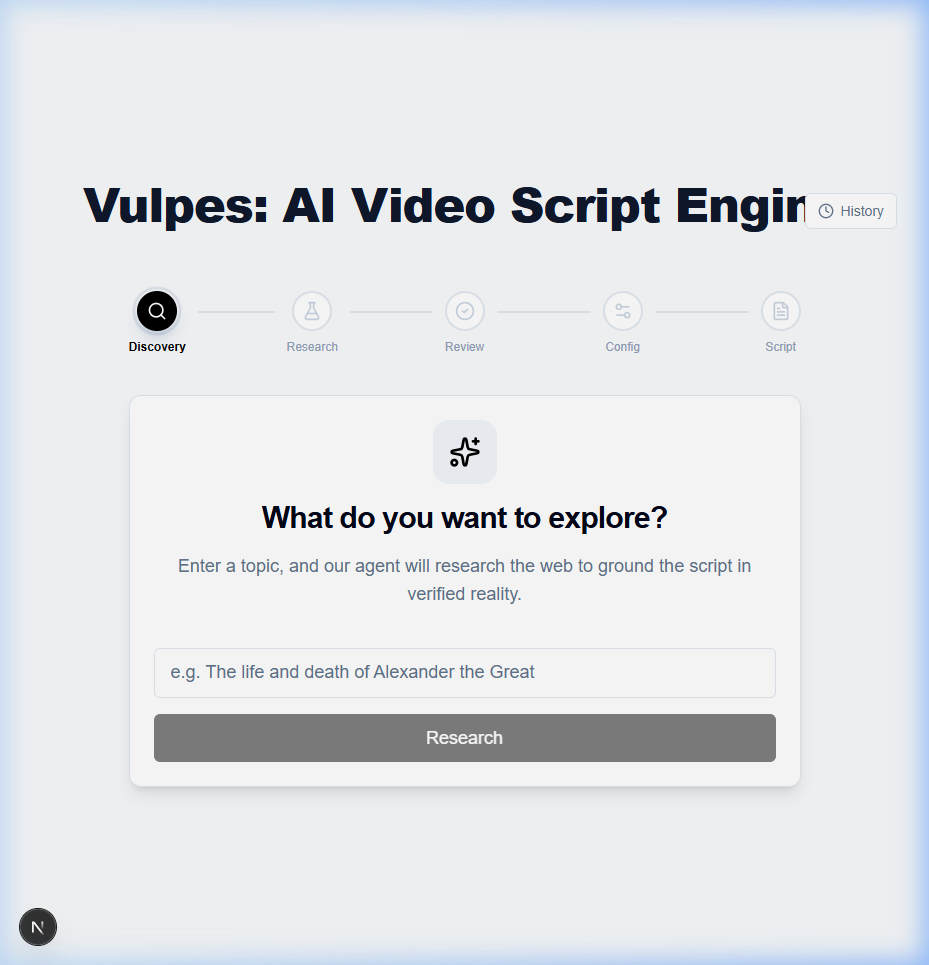

# Vulpes lagopus — AI Video Script Engine

A research-first AI video script generator built with Next.js 16, the Vercel AI SDK, and GPT-4o. Instead of generating scripts from thin air, Vulpes lagopus first researches a topic, surfaces verifiable facts for human review, and then generates a grounded script — reducing hallucination by design.



## Features

- **5-Step Wizard Flow** — Discovery → Research → Fact Review → Config → Script Generation
- **Agentic Research Phase** — Structured object streaming (via `streamObject`) with a live terminal-style thought stream
- **Human-in-the-Loop** — Review and deselect individual facts before generation to control what the AI can reference
- **Live Script Streaming** — Token-by-token script generation with real-time word count and estimated narration time
- **Inline Revision** — Revise scripts with natural language instructions without starting over; full version history tracking
- **Export** — Download as Markdown or Plain Text
- **Persistent History** — Scripts auto-save to `localStorage` with a history drawer for browsing past generations

---

## Architecture

```
┌─────────────────────────────────────────────────────┐
│                     Next.js App                     │
├──────────────────────┬──────────────────────────────┤
│     Client (React)   │       Server (API Routes)    │
│                      │                              │
│  Wizard.tsx          │  /api/research   (streamObj)  │
│  ├─ StepDiscovery    │  /api/generate   (streamText) │
│  ├─ StepResearching  │  /api/revise     (streamText) │
│  ├─ StepReview       │                              │
│  ├─ StepConfig       │  All routes use:             │
│  └─ StepGeneration   │  - Vercel AI SDK (ai)        │
│                      │  - AI Gateway → GPT-4o       │
│  lib/                │  - Zod schemas               │
│  ├─ script-history   │                              │
│  └─ word-stats       │                              │
└──────────────────────┴──────────────────────────────┘
```

### Key Design Decisions

| Decision | Rationale |
|---|---|
| **Research before generation** | Forces the LLM to ground its output in explicit facts rather than free-associating. Reduces hallucination risk. |
| **`streamObject` for research** | Returns structured `{ logs, facts }` in a single streaming call. The `logs` array creates the agentic "thinking aloud" effect without requiring a real multi-step agent. |
| **`streamText` for generation** | Plain text streaming for the script body — simpler, faster, and produces better-formatted markdown than structured output for long-form content. |
| **Human fact review step** | The user can deselect any fact before generation. This is the core hallucination mitigation mechanism — the LLM's system prompt explicitly says "only use these facts." |
| **Client-side history (`localStorage`)** | No database needed for a take-home. Capped at 20 entries. Trade-off: not persistent across devices, but zero infrastructure cost. |
| **Framer Motion for transitions** | `AnimatePresence` with `mode="wait"` gives clean step transitions. Individual elements use `motion.div` for entrance animations. |
| **AI Gateway (`gateway()`)** | Abstracts the model provider, making it easy to swap between OpenAI, Anthropic, etc. without changing route code. |

### What I'd Do Differently in Production

- Replace `localStorage` with a database (Drizzle + Postgres) for cross-device history
- Add auth (NextAuth) so scripts are tied to user accounts
- Use a real web search tool (Tavily, Serper) in the research step instead of relying on the LLM's training data
- Add rate limiting and request validation middleware
- Implement streaming error recovery and partial result caching
- Add collaborative editing (multiple users revising the same script)

---

## Getting Started

### Prerequisites

- Node.js 18+
- An OpenAI API key (or any provider supported by [Vercel AI Gateway](https://sdk.vercel.ai/docs/ai-sdk-core/gateway))

### Setup

```bash
# Clone the repo
git clone https://github.com/ibaurr/vulpes-lagopus.git
cd vulpes-lagopus

# Install dependencies
npm install

# Create environment file
cp .env.local.example .env.local
# Then add your API key:
# AI_GATEWAY_API_KEY=sk-...
```

### Development

```bash
npm run dev
```

Open [http://localhost:3000](http://localhost:3000).

### Testing

```bash
# Unit tests (Vitest)
npm test

# Unit tests in watch mode
npm run test:watch

# E2E tests (Playwright — requires the dev server)
npx playwright install chromium   # first time only
npm run test:e2e
```

---

## Tech Stack

| Layer | Technology |
|---|---|
| Framework | [Next.js 16](https://nextjs.org) (App Router) |
| Language | TypeScript |
| AI SDK | [Vercel AI SDK v6](https://sdk.vercel.ai) (`streamText`, `streamObject`, `useCompletion`, `useObject`) |
| Model | GPT-4o (via AI Gateway) |
| Styling | [Tailwind CSS v4](https://tailwindcss.com) |
| Animation | [Framer Motion](https://www.framer.com/motion/) |
| Markdown | [react-markdown](https://github.com/remarkjs/react-markdown) |
| Validation | [Zod v4](https://zod.dev) |
| Unit Tests | [Vitest](https://vitest.dev) |
| E2E Tests | [Playwright](https://playwright.dev) |

---

## Project Structure

```
vulpes-lagopus/
├── app/
│   ├── api/
│   │   ├── research/route.ts    # Structured research streaming
│   │   ├── generate/route.ts    # Script generation streaming
│   │   └── revise/route.ts      # Script revision streaming
│   ├── layout.tsx               # Root layout + metadata
│   ├── page.tsx                 # Home page (Wizard + History)
│   └── globals.css
├── components/
│   ├── script-engine/
│   │   ├── Wizard.tsx           # Step orchestrator
│   │   ├── ProgressStepper.tsx  # Animated step indicator
│   │   ├── StepDiscovery.tsx    # Topic input
│   │   ├── StepResearching.tsx  # Agentic research stream
│   │   ├── StepReview.tsx       # Fact review + approval
│   │   ├── StepConfig.tsx       # Tone & length settings
│   │   ├── StepGeneration.tsx   # Script output + revision
│   │   └── ScriptHistoryDrawer.tsx  # History sidebar
│   └── ui/                      # Reusable UI primitives
├── lib/
│   ├── script-history.ts        # localStorage CRUD
│   ├── word-stats.ts            # Word count + read time
│   └── utils.ts                 # cn() helper
├── __tests__/
│   ├── unit/
│   │   ├── word-stats.test.ts
│   │   └── script-history.test.ts
│   └── e2e/
│       └── wizard-flow.spec.ts
├── vitest.config.ts
├── playwright.config.ts
└── package.json
```

---

## License

MIT
